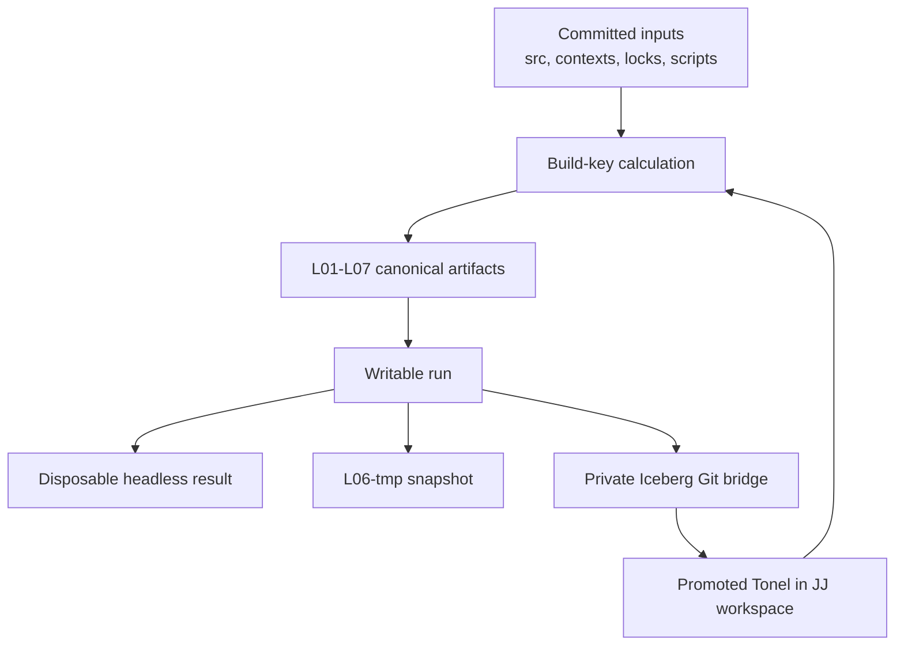

# KlibGen-GT build system: current implementation

- **Implementation snapshot:** `de58b924fdefd6e8705828ff231210280c09aea9`
- **Repository:** `piotrklibert/KlibGenGt`
- **Reviewed:** 2026-08-02
- **Primary scope:** `python/klibgen_build/`, the committed build definitions and
  Smalltalk stage scripts under `build/`, and
  `docs/klibgen-gt-reproducible-build-architecture-v0.1.md`.

## 1. Executive summary

The current implementation is a host-side Python coordinator for constructing
and operating a linear sequence of GToolkit image artifacts. It implements most
of the operational shape of the v0.1 specification:

- committed source, contexts, locks, layer definitions, and scripts are treated
  as authoritative;
- L01 through L07 are addressed by computed build keys;
- canonical artifacts are published atomically and made read-only;
- image execution happens in writable run copies, not in canonical artifacts;
- GUI state can be converted into immutable, resumable, explicitly
  non-canonical snapshots;
- project source is transferred between JuJutsu and Iceberg through generated,
  run-private Git repositories;
- contexts provide isolated JJ workspaces and Git worktree overrides;
- garbage collection, aggressive pruning, inventory, build-map, host tools,
  image tools, and live GUI control are present.

The implementation is nevertheless much less declarative than the
specification suggests. The seven `layer.json` files are labels and selection
metadata; the actual graph, inputs, transformations, tests, manifests, and
publication rules are hard-coded in `artifacts.py`. This has two important
effects:

1. build-key invalidation is simultaneously too broad and incomplete;
2. storage is multiplied at several independent boundaries.

The rapid disk growth is an architectural consequence, not a single leaking
temporary directory. A complete image bundle is represented repeatedly:

- once at each of L02, L03, L04, L05, and L06;
- again inside L07, together with another runtime copy;
- separately for every context, even when two contexts have the same build key
  through several layers;
- again for every active or failed run;
- again for every saved GUI snapshot;
- again in the separate state root retained by `test-fresh`;
- sometimes with image-local `pharo-local` repositories and copied Lepiter
  databases included.

`cp --reflink=auto` reduces initial physical use on a supporting filesystem, but
it does not change the logical multiplicity. It becomes a full copy on a
filesystem without reflinks, and image saves or Metacello activity can make
large copy-on-write regions private. Routine `gc` also deliberately retains all
snapshots, stopped runs, forced-rebuild records, and the current artifact graph
of every committed/generated context. Only `prune` removes most of these
categories.

## 2. Architectural lineage

Three documents describe different stages of the design:

- `docs/ARCHITECTURE.md` is explicitly historical. It proposed a TOML-based
  graph, named `project-agent`, `project-test`, and related images, a running
  image IPC service, and shell-oriented orchestration.
- `docs/klibgen-gt-reproducible-build-architecture-v0.1.md` is the normative
  specification. It replaced the earlier graph with stable L01-L07 identifiers,
  introduced contexts and content-derived build keys, classified GUI saves as
  L06-tmp snapshots, and aligned the main project with JuJutsu.
- `docs/todo/step-001.md` through `step-012.md` record the staged implementation
  of that specification.

The code follows the v0.1 specification and staged migration, not the concrete
filesystem and command plan in the historical document. Later commits added
functionality beyond the initial twelve stages: build-map visualization,
structured one-shot image tools, live Scripter-based GUI control, controlled GUI
shutdown, automatic Iceberg-to-JJ promotion, and the in-world Export button.

Two historical choices are notably superseded:

- headless operations do not use one long-lived `project-agent` image; each
  operation gets a disposable writable copy of canonical L06;
- ordinary GUI use is based on a current snapshot or a freshly constructed run,
  with an explicit refresh record after promoted source changes, rather than
  simply opening a possibly stale shared development image.

## 3. System model



The canonical graph is linear:

```text
L01 runtime
  -> L02 gt-base
  -> L03 gt-patched
  -> L04 project-deps
  -> L05 project-setup
  -> L06 project-dev
  -> L07 project-dist

L06 -> writable run -> L06-tmp snapshot
```

L06-tmp is intentionally outside the canonical chain and can never be an L07
parent.

### 3.1 Authoritative state

The implementation treats these as authoritative inputs:

- the outer JJ repository, particularly `src/`;
- `build/contexts/*.json` and generated context definitions;
- `build/locks/default.lock.json` and `.tool-versions-or-lock/` pins;
- `build/layers/*/layer.json`, stage scripts, and contract tests;
- the Python coordinator itself;
- explicitly attached Git worktrees for GT or SQLite3.

The ignored `export/` repository is legacy transport state. Canonical L06 builds
and writable runs create their own Git bridges instead.

### 3.2 Generated state

`BuildPaths.discover()` finds the repository by walking upward for a `justfile`
and `build/layers`, then selects `.klibgen/` unless `KLIBGEN_STATE_ROOT` is set.
Relative state roots are resolved against the repository root, not the caller's
working directory.

The active state root contains:

```text
artifacts/<platform>/<context>/<layer>/<build-key>/
runs/<context>/<run-id>/
snapshots/<context>/<snapshot-id>/
contexts/
workspaces/
worktrees/
worktree-metadata/
logs/rebuilds/
state/gui/
state/gui-refresh/
state/locks/
state/pins/
tmp/attempt-*/
```

Acquisition state under `vendor/`, Python state under `.venv/` and
`tmp/uv-cache/`, the legacy `export/`, and alternative roots such as
`artifacts/fresh-layered/` are outside the normal `.klibgen` inventory and GC
scope.

## 4. Python coordinator modules

| Module | Responsibility |
| --- | --- |
| `core.py` | Repository/state discovery, canonical JSON, SHA-256 JSON digests, context/layer loading, platform ID. |
| `sources.py` | Git branch resolution, JJ identity capture, lock construction/validation, host facts. |
| `artifacts.py` | Build keys, expected artifact graph, L01-L07 builders, image copying, manifests, locking, atomic publication. |
| `runs.py` | Writable base/L06 run creation, per-run bridges and host directories, stopped-run cleanup. |
| `operations.py` | Tests, eval, image tools, GUI launch/save behavior, automatic promotion events, build-map runs. |
| `lifecycle.py` | Snapshot publication/resume/selection, run/snapshot discard, manual and automatic package promotion, GUI refresh state. |
| `contexts.py` | Generated contexts, JJ workspaces, and attached Git worktrees. |
| `retention.py` | Pins, routine GC, aggressive prune, and coordination with active builders/readers. |
| `inventory.py` | Build/storage graph, logical and allocated sizes, and relationship inventory. |
| `coordination.py` | Process-wide shared/exclusive retention lock with nested-call handling. |
| `processes.py` | Plumbum-based synchronous and asynchronous process execution. |
| `ui_control.py` | Filesystem request/response protocol for one active managed GUI. |
| `host_tools.py` | Linux `/proc` inspection, X11 window operations, screenshots, termination, and profiling. |
| `cli.py` | `argparse` command surface, compatibility context mapping, text/JSON output, and dispatch. |

The package has one runtime dependency, Plumbum, and exposes the
`klibgen-build` console entry point. `just` is a convenience frontend; Python
contains the substantive logic.

## 5. Configuration and source resolution

### 5.1 Layer definitions

The committed layer definitions establish stable IDs, the linear parent chain,
supported variants/profiles, and mutation policy. They do not name their build
scripts, input paths, output contract, or tests. `load_layers()` additionally
requires exactly L01 through L07 in lexical order.

Consequently, adding a new layer, changing the graph shape, or substituting a
stage implementation requires changing Python, not only configuration.

### 5.2 Contexts

A context selects:

- L01 downloaded or local-build runtime;
- L02 release or source-clean image;
- L03 baseline or `klibgen`, optionally with a GT worktree;
- L04 locked SQLite3 or a worktree override;
- L05/L06 CLI, GUI, or placeholder AGENTIC profile;
- L07 DEV or placeholder RELEASE profile;
- a JJ workspace and revision for project source.

Committed definitions take precedence over generated definitions with the same
name. Generated contexts are made by cloning a template and adding a real JJ
workspace under the state root. Git worktree attachment is supported only for
generated contexts and only for the `gt` and `sqlite3` roles.

The current committed contexts are `default`, `gui`, `source-clean`, `patched`,
`patched-gui`, `sqlite-local`, `agentic`, and `release`.

### 5.3 Locks

The default lock pins:

- GT release `v1.1.477` by archive URL and SHA-256;
- GT installer `v0.201.0` by URL and SHA-256;
- Pharo-SQLite3 by the full Git commit
  `44dee155676f9ac9be1c7ffac8caef90024968c4`.

`resolve --update` resolves only the SQLite3 `master` branch, regenerates the
lock, and verifies that the project baseline contains the resulting commit.
Archive values are read from `.tool-versions-or-lock/`.

Despite accepting a context argument, lock resolution is effectively
default-context-only: `expected_lock()` hard-codes `contextId: default`, only
`default.lock.json` is committed, and build-key calculation always reads that
file.

### 5.4 JJ identity

For L06/L07, `jj_identity()` records:

- commit ID and change ID;
- parents and bookmarks;
- workspace and requested revision;
- whether the selector is literally `@`;
- conflicts reported by `jj resolve --list`;
- changed paths from `jj diff --summary`.

The exact commit ID is used to materialize source. The full identity object,
including display-oriented fields such as bookmarks and changed paths, enters
the build key.

## 6. Build keys and staleness

For each layer, `layer_key()` hashes canonical JSON containing:

```text
schema version
complete layer.json object
selection for this layer in the context
parent build key
the complete default lock
platform_id() = <lowercase OS>-<lowercase machine>
one global implementation digest
optional source state
```

Source state is present only for:

- L04 when SQLite3 has a worktree override;
- L06 and L07, where it is the JJ identity.

The implementation digest contains:

- every `python/klibgen_build/*.py` file;
- every layer definition;
- every layer contract test;
- every `scripts/patch-gt-*` file.

The parent key propagates every ancestor change to all descendants. The graph
function calculates all seven keys and derives each expected path. Status is
therefore a comparison between the expected path and already published paths;
old artifacts are not modified to mark them stale.

### 6.1 Over-invalidation

The global implementation digest means any Python change—including a change
only to X11 helpers, inventory rendering, retention output, or CLI formatting—
changes L01 and therefore all seven keys. The complete lock similarly makes an
SQLite3-only lock change invalidate L01 and L02. Every layer definition and
every layer test also affects every layer.

This is more conservative than the specification's intended per-layer path
rules and is a direct source of complete artifact-chain turnover.

It also contradicts the narrower acceptance statement in `step-006.md` that a
declared GT patch change should leave L01/L02 keys unchanged: patch scripts are
part of the global digest used by L01.

### 6.2 Under-invalidation

Several files that materially affect builds are absent from the implementation
digest, including:

- L04's `scripts/load.st` and `dependencies.json`;
- L05's `scripts/install-metadata.st`;
- L06's `scripts/load.st`, `bind-run.st`, and related tool/setup scripts;
- runtime bootstrap scripts;
- `pyproject.toml` and `uv.lock`.

Some tests are covered because all files below `build/layers/l*/tests/` are
hashed, but the transformation scripts above are not. A change to one of these
omitted inputs can incorrectly reuse an old artifact with the same expected
key. Thus the present invalidation policy can both rebuild far too much and
fail to rebuild when required.

### 6.3 Artifact reuse checks

Reuse is based on the existence of `<artifact>/manifest.json`. The builder does
not re-read and verify `status == success`, validate the manifest schema,
confirm its key against the directory, or verify output checksums before reuse.
Normal publication only places successful manifests there, but corruption or a
manually incomplete directory is not robustly handled.

There is also an edge case in publication: if an expected artifact directory
exists without a manifest, a new attempt is built, but `_publish()` sees the
existing directory, discards the attempt, and returns the incomplete directory.

## 7. Layer construction

### 7.1 Common publication protocol

Each builder recursively ensures its parent, computes the expected artifact,
and then:

1. acquires a shared retention lock;
2. acquires an exclusive `flock` for context/layer/key;
3. creates a UUID-named attempt under `state/tmp/`;
4. reflinks or copies the parent image/bundle;
5. makes the attempt writable;
6. runs the stage transformation and contract scripts;
7. writes logs and output checksums;
8. writes `manifest.json`;
9. atomically renames the attempt to its final artifact path;
10. recursively removes write bits from the artifact.

Failed attempts remain under `tmp/attempt-*` with a failed manifest and partial
image. An existing successful artifact is never replaced by a failed build.

A forced build retains the same key. If an artifact already exists, the
successful new attempt is moved under `logs/rebuilds/<context>/<layer>/<key>/`
and the original artifact remains canonical. These retained attempts are
removed by `prune`, not routine `gc`.

### 7.2 L01 — runtime

For `downloaded`, the bootstrap script downloads and verifies the pinned GT zip,
unpacks it under `vendor/gt`, and retains the zip. L01 copies `bin/` and `lib/`
into an artifact and records checksums for the GUI and CLI launchers.

For `local-build`, the coordinator invokes the GT installer to create a clean
source-built workspace under `vendor/gt-build/workspaces/clean`, then copies its
runtime directories.

The local source-build path is not fully reproducible in the v0.1 sense. It can
use `latest-release`, does not put the resolved GT source repository commits in
the build key or manifest, and reuses an existing workspace based on expected
files. The large `vendor/gt-build` source/workspace tree is also outside state
inventory and retention.

### 7.3 L02 — clean GT image

The release variant extracts the `.image`, `.changes`, `.sources`, and
`gt-extra/` files from the verified GT zip into the L02 artifact. The
source-clean variant copies these files from the local clean workspace.

The contract evaluates `1 + 2`, checks for `BaselineOfGToolkit`, rejects an
already loaded `KlibGenGt`, and checks a Lepiter file in `gt-extra`.

The manifest hashes the image and `gt-extra`, but not every file in the bundle.

### 7.4 L03 — GT patch selection

L03 always copies L02. `baseline` performs no transformation. `klibgen` runs
the hard-coded `patch-gt-headless-webview.st`, which recompiles
`GtWebViewLibrary class>>startUp:` to skip WebView initialization in headless
images. Its contract checks precisely that method-body distinction.

An attached GT worktree affects the build key and is recorded in the manifest,
but its source is not loaded into the image. Arbitrary worktree changes can
therefore change provenance and invalidate descendants without changing the
L03 output. Conversely, the actual output is the fixed patch script's result,
not a general build of the selected GT worktree. `changedPackages` is hard-coded
to `GToolkit-WebView`.

The separate `bootstrap-gt-source.sh patched` path builds a patched local GT
workspace for compatibility/debugging, but `artifacts.py` selects the clean
workspace for L01/L02 and applies the image patch at L03.

### 7.5 L04 — project dependencies

L04 copies L03 and loads exactly one dependency: Pharo-SQLite3's `Core` group.
The default Metacello URL names the exact locked commit. A context override is
translated to a `gitlocal://` URL naming the worktree and its current commit.

The contract checks that SQLite classes exist, queries the native library
version, and opens an in-memory database. The manifest records repository,
lock, load order, override state, and a hard-coded package mapping.

`dependencies.json` describes SQLite3 declaratively, but the Python builder does
not read it; dependency selection, metadata, loader path, and verification are
hard-coded. The dirty-worktree digest includes status lines and the contents of
changed paths that are regular files. It may not fully cover untracked directory
contents or more complex Git states.

Metacello may create `pharo-local` repositories below the image directory. The
builder does not strip them from L04-L06, so they can travel with every
descendant image bundle. L07 explicitly removes `image/pharo-local` and
`image/gt-extra` from its distribution copy.

### 7.6 L05 — project setup

L05 copies L04 and accepts CLI or GUI; AGENTIC rejects with an explicit
placeholder error. It serializes the L01-L04 manifests as canonical JSON,
computes their digest, and installs a generated `KlibGenBuildMetadata` class in
the image. That class exposes the lower manifests, digest, and selected profile.

CLI and GUI run the same setup script and contain the same base GT facilities;
their principal canonical difference is recorded profile metadata. They are
nevertheless separate full image artifacts, and separate contexts prevent even
their common ancestors from sharing an artifact directory.

### 7.7 L06 — project development

L06 copies L05, captures the selected JJ identity, and rejects conflicts. It
materializes every file under `src/` from the exact commit with `jj file show`,
creates a new Git repository, commits the materialization, and gives Metacello a
`gitlocal://...:master/src` URL. The `CI` group is loaded and the complete
project test contract is run.

The temporary build bridge is deleted before publication. The artifact keeps a
source mapping, source identity, bridge commit, profile, package mapping, and
image checksum. CLI and GUI are distinct full artifacts. AGENTIC remains a
placeholder.

The build bridge is exact and isolated, but materialization invokes one `jj`
subprocess per source file and only supports UTF-8 text under `src/`.

### 7.8 L07 — DEV distribution

L07 accepts only DEV and only a CLI L06 parent. RELEASE always rejects. It
copies the L01 runtime and L06 image into a bundle, removes `pharo-local` and
`gt-extra`, creates `bin/klibgen-gt`, writes project/version metadata, runs a
startup smoke test, and writes `SHA256SUMS` for every bundle file.

This is a directory bundle, not a compressed release archive. It contains a
second runtime and image representation in addition to its parent artifacts.

## 8. Manifest model

All layer manifests contain ID/name, context, build key, status, timestamp,
parent key, variant, platform string, inputs, outputs, tests, dirty/host-bound
flags, and overrides. Individual builders add source mappings and profile or
distribution details.

The checked-in JSON Schema is intentionally permissive and is not applied by
the builders. There is no central manifest reader that validates a published
artifact before reuse.

Output hashing is selective:

- L01 hashes two launchers, not the entire runtime;
- L02 hashes the image and `gt-extra`, not the complete image bundle;
- L03-L06 primarily hash the `.image` file;
- L07 produces the most complete inventory through `SHA256SUMS`.

This is sufficient for diagnostics and identity breadcrumbs but not a complete
content-addressed or independently verifiable artifact model.

## 9. Writable runs and one-shot operations

`create_project_run()` first builds/reuses L06, then creates:

```text
runs/<context>/<uuid>/
  image/
  export/.git + src/
  home/
  config/
  data/
  cache/
  logs/
  tmp/
  run.json
```

The image is a writable reflink/copy of canonical L06. `export/` is another
fresh Git materialization of the exact JJ commit. `run.json` records both L06
and L01 ancestry, project identity, bridge commit, launcher, lifecycle state,
PID, arguments, and isolated paths.

Tests, smoke checks, type checks, eval, code search, code/class/method export,
Lepiter search/export, and profiler-assisted eval are all one-shot run
operations. Successful headless runs are deleted. Failed operations retain the
complete run for diagnosis. Structured test results are written beside logs and
can be reopened without restarting the image.

The coordinator isolates HOME and XDG paths, but canonical build commands and
ordinary headless runs start from `os.environ.copy()`. Undeclared locale,
proxy, tool, library, and other environment values can therefore influence a
build without entering its key. GUI launch uses a smaller allowlist and records
its effective environment, redacting proxy values and `SSH_AUTH_SOCK` as
hashes.

Fresh GUI and some image-tool runs copy the host's entire
`~/Documents/lepiter` tree into private HOME. This is a normal copy, not the
coordinator's reflink helper, and can materially increase transient and retained
run size.

## 10. GUI lifecycle, snapshots, and source promotion

### 10.1 GUI launch

Ordinary `gui` uses, in priority order:

1. a pending source-refresh request, which forces a fresh run;
2. the context's selected snapshot, if any;
3. a fresh writable GUI run from canonical L06.

An explicit fresh launch bypasses snapshot selection. An explicit snapshot
launch resumes that snapshot without moving the current pointer.

Fresh runs execute `bind-run.st`, rebind Iceberg to the run-private bridge,
install GUI session hooks and UI control, set `BlSpace userScale`, save, and
then launch the normal GUI executable. Resumed runs start their saved image
directly and report JJ/workspace divergence without altering the snapshot's
state.

### 10.2 Save detection and snapshot publication

After the GUI exits, the coordinator compares the image hash, examines appended
`.changes` records, and consumes the GUI event journal. A changed image plus a
save/quit marker or saved event counts as a successful save.

A successful save creates a new schema-v2 snapshot. The snapshot copies and
hashes:

- `image`;
- `export`;
- `home`;
- `config`;
- `data`;
- `logs`.

`cache` and `tmp` are excluded. The snapshot is made read-only, atomically
published, optionally selected as current, and—during normal GUI shutdown—the
source run is deleted.

Resuming creates another writable copy of all snapshot components. Saving that
run creates another immutable snapshot; earlier snapshots are retained. The
current pointer is selection metadata, not a moving or overwritten snapshot.

### 10.3 Promotion

Iceberg changes live in the run/snapshot's private Git bridge. Manual promotion
requires explicit `KlibGenGt-*` package names. Automatic promotion listens for
`iceberg-committed` events, compares the last promoted bridge commit with HEAD,
and identifies committed project packages.

Promotion is serialized by a global promotion lock. Before copying a package
into authoritative `src/`, it checks that:

- the source package exists;
- the bridge has no later uncommitted change to that package when automatic
  promotion is used;
- the destination package has not diverged since run creation or last
  promotion.

The destination is currently restricted to the root JJ workspace. Promotion
copies Tonel directories but does not create a JJ commit. It leaves reviewable
working-copy changes for the user or agent.

Successful GUI promotion writes a generation-tagged refresh record. The next
ordinary GUI launch starts from current JJ source rather than resuming the old
snapshot. Conflicts create a blocked refresh record and stop ordinary launches
until explicitly reconciled and cleared.

### 10.4 Live GUI control

Managed GUIs expose a local filesystem spool below `run/tmp/ui-control/`.
Requests and responses are JSON files published by atomic rename. The client
requires one uniquely selected, active, ready GUI, polls for a matching response,
and removes timed-out unclaimed requests.

The protocol supports scene-tree/status inspection, selectors, Scripter-backed
actions, waits, batches, and diagnostic eval. This is local filesystem IPC; no
network listener or authentication service is involved.

## 11. Context and worktree lifecycle

`context-create` creates a context-local JJ workspace and generated context
definition. `worktree-add` creates detached Git worktrees for GT or SQLite3 and
patches the generated context. Removal refuses dirty Git worktrees.

Context removal refuses:

- active runs;
- any snapshots;
- attached Git worktree metadata;
- unpromoted changes in its JJ workspace.

Stopped runs do not block context removal and can remain after the context
definition disappears. Worktree removal does not explicitly coordinate with an
active build beyond the general filesystem/process behavior.

Context identifiers accepted by Python are slightly broader than the checked-in
schema: Python permits underscores and uppercase letters, while the schema
allows lowercase letters, digits, and hyphens only.

## 12. Retention and storage inventory

### 12.1 Routine GC

`gc` preserves:

- the currently expected successful artifacts of every resolvable committed or
  generated context;
- all artifacts in an unresolved context, as a safety fallback;
- artifact ancestry referenced by every snapshot;
- explicitly pinned artifacts;
- active runs and their L01/L06 ancestry;
- the three newest failed/in-progress attempt directories.

It removes other canonical artifacts and older attempts.

Routine GC does **not** remove:

- stopped or never-started runs;
- any snapshot, current or historical;
- forced-rebuild records under `logs/rebuilds`;
- generated contexts, JJ workspaces, or Git worktrees;
- vendor downloads/source builds;
- `.venv`, uv cache, or legacy export state;
- alternative state roots such as `artifacts/fresh-layered`.

`clean-runs <context>` separately deletes stopped runs for one context.

### 12.2 Prune

`prune` is the clone-like reset. It preserves only:

- current artifacts for `default` and `gui`;
- pins;
- active runs and their ancestry.

It removes other context artifacts, stopped runs, every snapshot and snapshot
pointer, every attempt, and all forced-rebuild records. Generated contexts,
workspaces/worktrees, pins, active runs, and GUI refresh records remain.

### 12.3 Inventory and build map

The inventory models definitions, contexts, locks, artifacts, runs, snapshots,
attempts, pins, workspaces, worktrees, pointers, refresh records, and auxiliary
state as nodes with relationship edges. It measures apparent bytes, allocated
filesystem blocks, file count, and immediate component sizes without following
symlinks.

Allocated block counts still double-count reflink-shared extents and are not
exclusive/reclaimable sizes. The inventory also omits storage outside the active
state root, notably `vendor/` and fresh-test roots.

The interactive and PNG build maps themselves build/reuse a GUI or CLI L06 and
create a writable run. Inspection can therefore require substantial additional
transient storage when the relevant artifact chain is missing or stale.

## 13. Why storage grows so quickly

Let `I` be the logical size of an image bundle after dependencies are loaded and
`R` the runtime size. Ignoring logs and source bridges, one fully built CLI
context stores approximately:

```text
L01: R
L02: I
L03: I
L04: I
L05: I
L06: I
L07: R + I (with some image-local caches removed)
```

That is roughly `6I + 2R` of logical files for one context. Initial physical
allocation can be much smaller with reflinks, but the model still creates six
independent image owners.

The following effects multiply it further.

### 13.1 Context-path duplication

Artifact paths include the context before the layer and build key. `default`
and `gui` have identical selections through L04 and compute the same keys there,
but publish into different directories. They cannot reuse the same L01-L04
artifact. The same applies to other committed contexts with common prefixes.

Routine GC treats the expected graph of all eight committed contexts as live.
Even placeholder contexts can retain their successfully built lower layers.

### 13.2 Full image at pass-through or small-delta layers

Baseline L03 is a complete L02 copy even though it applies no transformation.
L05 is a complete L04 copy for a small generated metadata/profile difference.
CLI and GUI are full separate L05 and L06 images despite sharing almost all
contents.

### 13.3 Copy-on-write is conditional

`--reflink=auto` silently falls back to an ordinary copy. On a reflink-capable
filesystem, a Smalltalk image save, package load, source-cache update, or changes
journal append can still allocate private extents. Image save behavior need not
touch only a tiny suffix, so the real physical cost of another layer or snapshot
can approach a full image.

### 13.4 Metacello/Iceberg state travels inside image bundles

L04 can create `pharo-local` Git repositories and other image-local state. That
directory is copied into L05, L06, runs, and snapshots. It is removed only from
the L07 bundle. `gt-extra` similarly travels through the canonical chain and is
removed only at L07.

### 13.5 Snapshots are append-only full-state records

Each successful GUI save publishes a new immutable copy of image, bridge, HOME,
configuration, data, and logs. Old snapshots remain, and routine GC preserves
their entire artifact ancestry. Resuming and saving again creates another
snapshot rather than replacing the old one.

This is likely the most visible long-running source of growth during interactive
development.

### 13.6 Runs and diagnostics persist on failure or interruption

Successful headless runs disappear, but failed tests/tools, interrupted or
quit-without-save GUIs, and unsuccessful build-map runs retain their complete
image. Routine GC ignores stopped runs. Failed build attempts retain another
partial/full image, and forced rebuild results persist until prune.

### 13.7 Fresh testing uses another unmanaged state root

`test-fresh` deletes and reconstructs `artifacts/fresh-layered`, then leaves its
L01-L06 chain in place after the successful run is removed. Normal `.klibgen`
GC does not see this root.

### 13.8 Acquisition and personal data are outside accounting

Downloaded mode retains the GT zip and unpacked vendor runtime. Source mode can
retain clean and patched GT source trees and complete built workspaces.
Fresh GUI creation copies `~/Documents/lepiter`, and snapshots retain that copy.
None of these costs is fully represented by the normal state-root total.

## 14. Spec-to-implementation assessment

| Spec area | Current status | Notes |
| --- | --- | --- |
| External authoritative source | Implemented | JJ `src/`, contexts, locks, scripts, and explicit bridges are primary; images are outputs. |
| Stable L01-L07 graph | Implemented | Fixed, linear, and enforced in Python. |
| Automatic ancestor construction | Implemented | Recursive builders reuse expected paths and build missing ancestors. |
| Canonical immutability | Implemented with caveats | Atomic read-only publication and writable run copies; reuse does not verify manifests/checksums. |
| Failure isolation | Implemented | Failed attempts remain outside canonical paths. |
| Functional reproducibility | Partial | Downloaded path is pinned; local source builds and undeclared environment inputs remain hidden/movable. |
| Exact build-key inputs | Partial/unsound | Global over-invalidation plus omitted transformation scripts. |
| Declarative layer contracts | Mostly not implemented | Layer behavior is hard-coded; JSON definitions are skeletal. |
| Manifest provenance | Partial | Useful ancestry/source metadata, but selective output hashing and no validation on reuse. |
| L03 worktree variants | Partial | Worktree changes affect identity but are not generally loaded; one fixed image patch is applied. |
| L04 dependency protocol | Minimal | One hard-coded SQLite3 dependency; declarative dependency file is not interpreted. |
| CLI/GUI profiles | Implemented as separate artifacts | They mostly differ by metadata; AGENTIC is an allowed placeholder. |
| L06 exact project source | Implemented | Exact JJ commit is materialized through a private Git bridge and tested. |
| L06-tmp snapshots | Implemented | Explicitly non-canonical, resumable, immutable, and excluded from L07. |
| Package promotion | Implemented for project packages | Root JJ workspace and `KlibGenGt-*` only, with conflict checks. |
| L07 DEV | Implemented | Directory bundle with launcher, smoke test, version and checksums. |
| L07 RELEASE | Placeholder | Rejects all builds, which is permitted by the v0.1 simplification. |
| Context isolation | Implemented for mutable state | Strong path isolation, at the cost of no cross-context immutable artifact sharing. |
| Concurrency | Implemented for publication/retention | Per-artifact `flock`, shared/exclusive retention lock, promotion lock. |
| Normalized build environment | Not implemented | Canonical builders inherit the host environment. |
| Process ownership/leftover detection | Partial | PIDs and child exits are tracked; no timeout or general descendant-process registry. |
| Explicit retention | Implemented | Safe GC and aggressive prune exist, but routine policy retains major growth categories. |
| Agent-friendly operation | Implemented substantially | JSON CLI, image tools, diagnostics, build inventory, filesystem GUI control, and X11 helpers. |

## 15. Important current invariants

The following properties are reliable foundations for the next design:

- canonical artifacts are never intentionally executed writable in place;
- a successful normal publication is immutable and addressed by context, layer,
  platform, and key;
- a build failure does not replace a successful artifact;
- project source loaded into L06 comes from an exact JJ commit;
- every run has a private image, host state, and Iceberg bridge;
- snapshots are explicitly non-canonical and never feed L07;
- automatic project promotion is package-scoped and conflict-checked;
- L07 DEV requires canonical CLI L06;
- destructive retention is constrained to the selected state root and
  coordinated with builders/runs.

The following should not be assumed:

- that a build key covers every effective input;
- that two artifacts with the same key in different contexts share storage;
- that a worktree named in L03 was actually used as patch source;
- that an existing artifact was checksum-verified before reuse;
- that `gc` bounds total disk use;
- that build-map totals include vendor, fresh-test, or all tool caches;
- that reflinks are available or remain cheap after an image save;
- that local source-built GT is pinned to exact upstream commits;
- that CLI and GUI canonical images materially need to be separate.

## 16. Validation performed for this review

The review inspected the complete Python package, all layer/context/lock
definitions, relevant Smalltalk stage scripts and contracts, the root README,
the normative v0.1 specification, the historical architecture document, the
twelve implementation stage records, and recent GUI/export documentation.

The host-side unit suite was invoked directly with `uv` because `just` is not
installed in the review environment. Of 56 tests:

- 53 completed successfully;
- two errored because the environment does not provide `jj`;
- one host-process JSON test errored because the sandbox did not expose the
  expected process through `/proc`.

The failures are environment/tooling limitations in this review environment,
not evidence that the corresponding assertions fail on the project's intended
host. Full GT builds and Smalltalk contracts were not run because no GT runtime
was acquired for this analysis.

## 17. Consequences for the revised design discussion

The current system demonstrates that the core source/image separation is
workable. Its inconvenient and storage-heavy behavior comes mainly from four
coupled decisions:

1. every conceptual layer owns a complete image artifact;
2. context identity is part of the storage path even when immutable inputs are
   identical;
3. profiles and resumable sessions are represented as full image copies;
4. retention optimizes for preserving every recoverable state rather than
   bounding storage automatically.

The next specification can therefore simplify the implementation without
abandoning exact JJ source capture, immutable canonical checkpoints, private run
state, or conflict-checked promotion. The main design question is which points
actually need durable image checkpoints and which distinctions can instead be
represented as launch-time configuration, source/cache references, manifests,
or replaceable session state.
